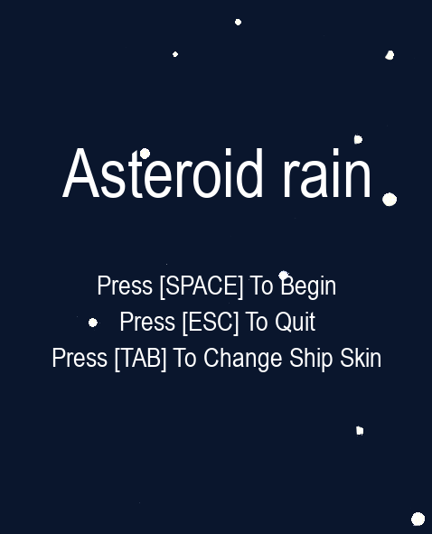
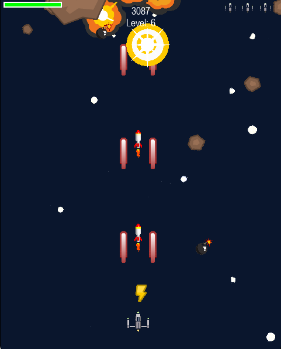

# Asteroid Rain

## Описание

  
Asteroid Rain -  шутер, в котором игрок управляет космическим кораблем, уничтожая метеориты и избегая столкновений.

## Особенности

- Возможность выбора из трех скинов для космического корабля.
- Фоновая музыка и звуковые эффекты.
- Возможность смены оружия.
- Бусты в игре: возможность восстановить щит, улучшение оружия на определенное время.

## Управление

- Стрелки влево и вправо: Перемещение космического корабля.
- SPACE: Стрельба.
- ESC: Выход из игры.
- TAB: Смена скина космического корабля в главном меню игры.

## Как поиграть?

1. Сделайте Fork репозитория.
2. Клонируйте репозиторий при помощи git clone.
3. Откройте проект. Для работы необходимо установить библиотеку pygame.
